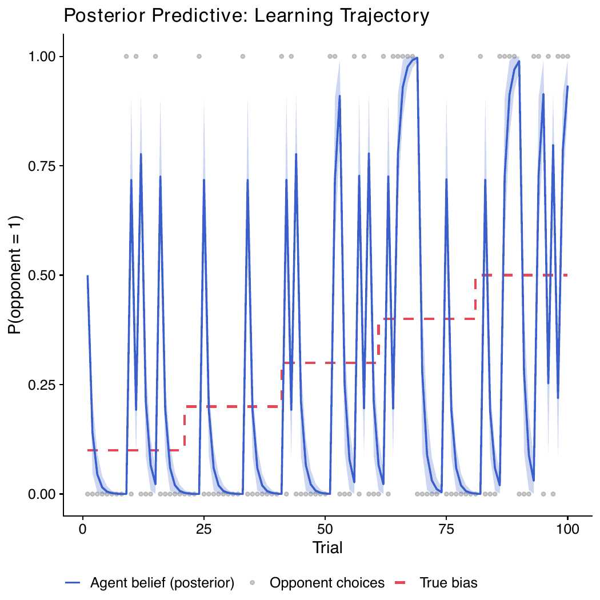
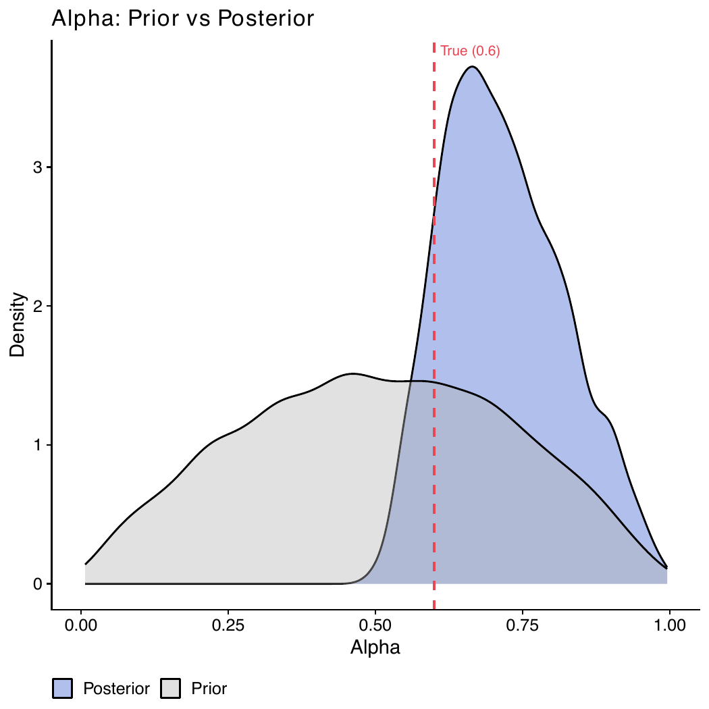

# ACM 2nd assignment

We fit a Rescorla-Wagner reinforcement learning model to a simulated agent playing against a volatile opponent. The opponent's tendency to choose 1 shifts every 20 trials, so a good learner needs to keep updating rather than settle.

The model has two parameters: **alpha** (how fast you update your belief after each outcome) and **tau** (how deterministically you act on that belief). Both are estimated with Stan via MCMC.

## What we do

1. **Prior predictive check** — make sure the model can produce sensible behaviour before seeing any data
2. **Prior-posterior update** - ensure that the model learns from the data
3. **Posterior predictive check** — fit the model to simulated data and see if it tracks the opponent
4. **Prior sensitivity analysis** — check that the posteriors are driven by the data, not the priors
5. **Parameter recovery** — simulate from known parameters, recover them, and check how close we get

## Plots

The learning trajectory shows the agent's belief about the opponent over 100 trials. The high learning rate (α = 0.6) means the agent reacts sharply to each new outcome — hence the swings.

The prior–posterior plot for alpha shows clear updating: the posterior (blue) has moved away from the prior (grey) and landed near the true value.

## Files

- `RL.stan` — the Stan model
- `param_recov.R` — simulation, fitting, and all plots
- `Rplots.pdf` — all output plots
